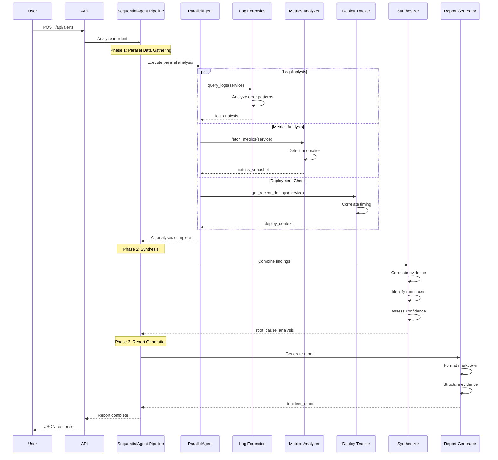
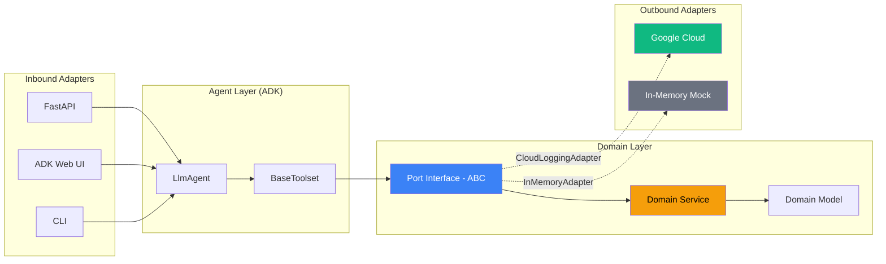
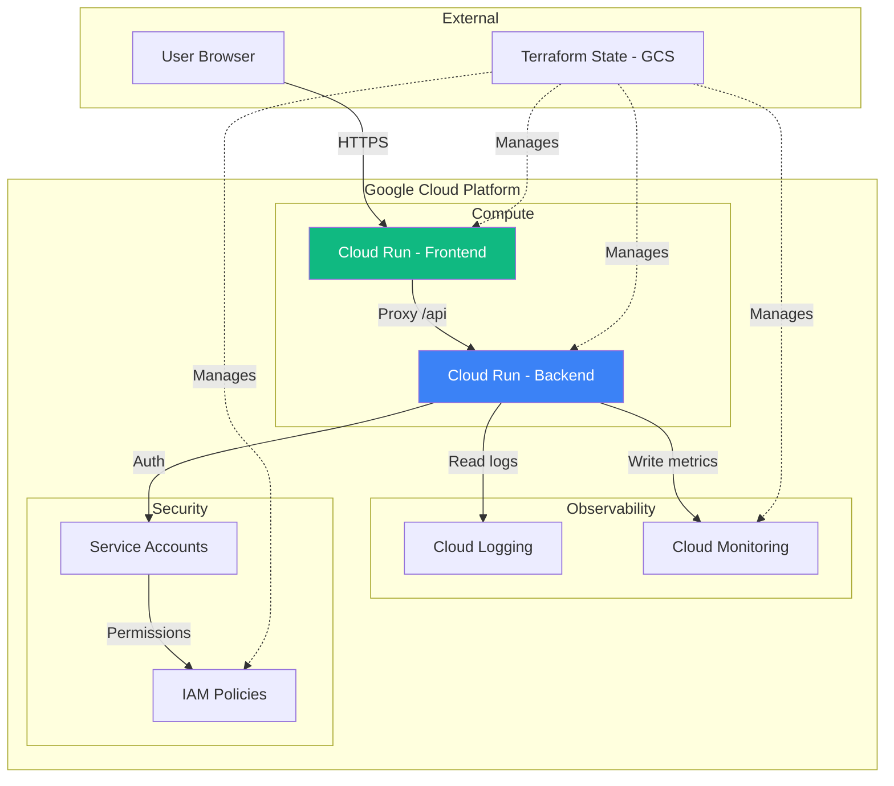

# Architecture

This document describes the architecture of the Incident Response Orchestrator, a multi-agent system built with Google ADK using hexagonal architecture.

## 1. System Overview

The system follows a monorepo structure with three distinct layers: infrastructure (Terraform), backend (ADK agents with hexagonal architecture), and frontend (Angular 22).

```mermaid
graph TB
    subgraph "Frontend (Angular 22)"
        UI[Dashboard UI]
        AlertForm[Alert Form]
        ReportView[Report Viewer]
    end

    subgraph "Backend (Python ADK)"
        API[FastAPI REST API]
        
        subgraph "Agent Layer"
            RootAgent[SequentialAgent Pipeline]
            ParallelAgent[ParallelAgent Fan-Out]
            LogAgent[Log Forensics Agent]
            MetricsAgent[Metrics Analyzer Agent]
            DeployAgent[Deploy Tracker Agent]
            SynthAgent[Synthesizer Agent]
            ReportAgent[Report Generator Agent]
        end
        
        subgraph "Toolset Layer"
            MonToolset[Monitoring Toolset]
            DeployToolset[Deployments Toolset]
            NotifToolset[Notifications Toolset]
        end
        
        subgraph "Domain Layer"
            Service[Incident Service]
            Models[Domain Models]
            Ports[Port Interfaces]
        end
        
        subgraph "Adapter Layer"
            GCPLogging[Cloud Logging Adapter]
            GCPMonitoring[Cloud Monitoring Adapter]
            GCPRun[Cloud Run Adapter]
            InMemory[In-Memory Adapters]
        end
    end

    subgraph "Infrastructure (Terraform)"
        CloudRun[Cloud Run Services]
        IAM[Service Accounts & IAM]
        Monitoring[Cloud Monitoring Alerts]
        Logging[Cloud Logging Sinks]
    end

    subgraph "Google Cloud Platform"
        GCP Logging[Cloud Logging]
        GCP Monitoring[Cloud Monitoring]
        GCP Run[Cloud Run]
    end

    UI --> API
    AlertForm --> API
    ReportView --> API
    
    API --> RootAgent
    RootAgent --> ParallelAgent
    ParallelAgent --> LogAgent
    ParallelAgent --> MetricsAgent
    ParallelAgent --> DeployAgent
    ParallelAgent --> SynthAgent
    SynthAgent --> ReportAgent
    
    LogAgent --> MonToolset
    MetricsAgent --> MonToolset
    DeployAgent --> DeployToolset
    
    MonToolset --> Ports
    DeployToolset --> Ports
    NotifToolset --> Ports
    
    Ports --> Service
    Service --> Models
    
    Ports -.->|implements| GCPLogging
    Ports -.->|implements| GCPMonitoring
    Ports -.->|implements| GCPRun
    Ports -.->|implements| InMemory
    
    GCPLogging --> GCP Logging
    GCPMonitoring --> GCP Monitoring
    GCPRun --> GCP Run
    
    CloudRun -.-> GCP Run
    IAM -.-> GCP Run
    Monitoring -.-> GCP Monitoring
    Logging -.-> GCP Logging

    style ParallelAgent fill:#3b82f6,color:#fff
    style SynthAgent fill:#f59e0b,color:#fff
    style ReportAgent fill:#10b981,color:#fff
```

## 2. Multi-Agent Orchestration Pipeline

The agent system uses a SequentialAgent pipeline with a ParallelAgent fan-out for concurrent analysis, followed by synthesis and report generation.



## 3. Hexagonal Architecture Data Flow

The hexagonal architecture ensures domain logic has zero dependencies on external systems. Ports define interfaces, adapters provide implementations, and toolsets bridge ports to ADK agents.



### Key Design Principles

1. **Dependency Rule**: Dependencies point inward. The domain layer imports nothing from adapters, toolsets, or agents.

2. **Port Isolation**: Ports use only Python `abc.ABC` and standard library types. No Google Cloud imports in the domain.

3. **Adapter Swapping**: Change one line in `factory.py` to swap `InMemoryMonitoringAdapter` for `CloudMonitoringAdapter`. The agent, domain, and toolset code remain untouched.

4. **BaseToolset as Port Bridge**: ADK's `BaseToolset` is the natural adapter between hexagonal ports and the agent's tool system.

### Data Flow Example

```
User Alert → API → Agent → Toolset → Port → Adapter → Google Cloud
                                        ↑
                              (Domain Service)
                                        ↓
                              Agent ← Toolset ← Port ← Adapter ← Response
```

## 4. Deployment Architecture



## 5. Component Responsibilities

| Component | Responsibility | ADK Type |
|-----------|---------------|----------|
| **LogForensicsAgent** | Query and analyze error logs | `LlmAgent` with `MonitoringToolset` |
| **MetricsAnalyzerAgent** | Fetch and interpret performance metrics | `LlmAgent` with `MonitoringToolset` |
| **DeployTrackerAgent** | Check recent deployments and correlate | `LlmAgent` with `DeploymentsToolset` |
| **SynthesizerAgent** | Combine findings into root cause | `LlmAgent` (no tools, reads state) |
| **ReportGeneratorAgent** | Format final incident report | `LlmAgent` (no tools, reads state) |
| **MonitoringToolset** | Bridge MonitoringPort to ADK tools | `BaseToolset` |
| **DeploymentsToolset** | Bridge DeploymentPort to ADK tools | `BaseToolset` |

## 6. State Management

Agents communicate via ADK session state using `output_key` and `{key}` templating:

```
┌─────────────────────────────────────────────────────────────┐
│                    Session State                             │
├─────────────────────────────────────────────────────────────┤
│  alert_context: {...}                                       │
│  log_analysis: {patterns: [...], frequency: ...}           │
│  metrics_snapshot: {error_rate: ..., latency: ...}         │
│  deploy_context: {recent_deploys: [...]}                   │
│  root_cause_analysis: {cause: ..., confidence: ...}        │
│  incident_report: {markdown: ..., json: {...}}             │
└─────────────────────────────────────────────────────────────┘
```

Each agent writes to a specific key, and downstream agents read via `{key}` instruction templating.
