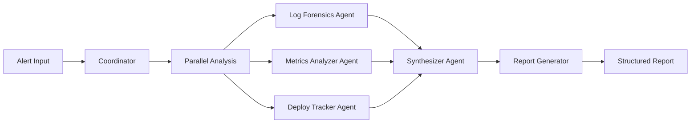

# Incident Response Orchestrator

> **All Things Agentic Hackathon** — Taskmaster Track

Multi-agent incident response system that automates production debugging. When alerts fire, three AI agents work in parallel to analyze logs, metrics, and deployments — then synthesize findings into a structured incident report with root cause analysis.

**Demo Video:** [YouTube](link-to-demo)  
**Live URL:** [Cloud Run](link-to-deployed-app)

## Problem

When production breaks, engineers waste 30+ minutes context-switching between:
- Log dashboards (Cloud Logging, ELK)
- Metrics views (Cloud Monitoring, Grafana)
- Deployment history (Cloud Run, GitHub)
- Slack threads and runbooks

This agent system does that work in **60 seconds**.

## Solution



## Tech Stack

| Layer | Technology |
|-------|-----------|
| **AI Model** | Gemini 3.5 Flash |
| **Agent Framework** | Google ADK (Agent Development Kit) |
| **Architecture** | Hexagonal (Ports & Adapters) |
| **Backend** | Python 3.12+, FastAPI |
| **Frontend** | Angular 22 (Signals, httpResource) |
| **Infrastructure** | Terraform, Google Cloud Run |
| **Cloud Services** | Cloud Logging, Cloud Monitoring, Firestore, Cloud Run |

## Spin-Up Instructions

### Prerequisites

- Python 3.12+
- Node.js 22+
- Google Cloud SDK (`gcloud`)
- Terraform (optional, for deployment)
- Just command runner (`brew install just`)

### 1. Clone and Setup

```bash
git clone https://github.com/shawal-mbalire/incident-response-orchestrator.git
cd incident-response-orchestrator
```

### 2. Backend Setup

```bash
cd backend

# Create virtual environment
python3 -m venv .venv
source .venv/bin/activate

# Install dependencies
pip install -e ".[dev]"

# Copy environment file
cp .env.example .env

# Edit .env with your GCP project ID
# AGENT_GCP_PROJECT_ID=your-project-id

# Run with ADK web UI (recommended for testing)
adk web src/incident_response

# Or run with uvicorn
uvicorn main:app --reload --port 8080
```

The ADK web UI will be available at `http://localhost:8000`.

### 3. Frontend Setup

```bash
cd frontend

# Install dependencies
npm install

# Start development server
npm start
```

The frontend will be available at `http://localhost:4200`.

### 4. Running Tests

```bash
# Run all tests (backend + frontend + infra)
just test

# Or run individually
just backend-test    # Python tests
just frontend-test   # Angular tests
just infra-test      # Terraform validate
```

### 5. Deploy to Google Cloud

#### Option A: Using Terraform + Docker

```bash
# 1. Authenticate with GCP
gcloud auth login
gcloud config set project YOUR_PROJECT_ID

# 2. Enable required APIs
gcloud services enable run.googleapis.com \
  cloudresourcemanager.googleapis.com \
  secretmanager.googleapis.com \
  logging.googleapis.com \
  monitoring.googleapis.com \
  artifactregistry.googleapis.com \
  firestore.googleapis.com

# 3. Build and push Docker images
export PROJECT_ID=your-project-id
export REGION=us-central1

# Build backend
docker build -t $REGION-docker.pkg.dev/$PROJECT_ID/incident-response/backend:latest ./backend
docker push $REGION-docker.pkg.dev/$PROJECT_ID/incident-response/backend:latest

# Build frontend
docker build -t $REGION-docker.pkg.dev/$PROJECT_ID/incident-response/frontend:latest ./frontend
docker push $REGION-docker.pkg.dev/$PROJECT_ID/incident-response/frontend:latest

# 4. Deploy with Terraform
cd infra/environments/dev
# Edit terraform.tfvars with your values
terraform init
terraform plan
terraform apply
```

#### Option B: Using gcloud CLI (quick deploy)

```bash
# Deploy backend
gcloud run deploy incident-response-backend \
  --source ./backend \
  --region us-central1 \
  --allow-unauthenticated \
  --set-env-vars="AGENT_ENVIRONMENT=production,AGENT_GCP_PROJECT_ID=your-project-id"

# Deploy frontend
gcloud run deploy incident-response-frontend \
  --source ./frontend \
  --region us-central1 \
  --allow-unauthenticated
```

### 6. Environment Variables

| Variable | Default | Description |
|----------|---------|-------------|
| `AGENT_ENVIRONMENT` | `development` | `development` or `production` |
| `AGENT_GCP_PROJECT_ID` | — | Your Google Cloud project ID |
| `AGENT_GCP_REGION` | `us-central1` | GCP region |
| `AGENT_AGENT_MODEL` | `gemini-3.5-flash` | Gemini model to use |

## Architecture

See [ARCHITECTURE.md](./ARCHITECTURE.md) for detailed architecture documentation with Mermaid diagrams.

### Hexagonal Architecture

```
┌─────────────────────────────────────────────────────────┐
│                    Domain Layer                          │
│  (Models, Ports, Services - zero external dependencies) │
└─────────────────────────────────────────────────────────┘
                        ▲
                        │ implements
┌───────────────────────┴─────────────────────────────────┐
│                   Port Interfaces                        │
│  MonitoringPort | DeploymentPort | StateStorePort        │
└─────────────────────────────────────────────────────────┘
                        ▲
                        │ adapts
┌───────────────────────┴─────────────────────────────────┐
│                  Outbound Adapters                       │
│  CloudLoggingAdapter | CloudMonitoringAdapter            │
│  CloudRunAdapter | FirestoreAdapter | InMemoryAdapters  │
└─────────────────────────────────────────────────────────┘
                        ▲
                        │ bridges
┌───────────────────────┴─────────────────────────────────┐
│                   ADK Toolsets                           │
│  MonitoringToolset | DeploymentsToolset                  │
└─────────────────────────────────────────────────────────┘
                        ▲
                        │ uses
┌───────────────────────┴─────────────────────────────────┐
│                  ADK Agents                              │
│  SequentialAgent → ParallelAgent → Synthesizer → Report  │
└─────────────────────────────────────────────────────────┘
```

## Project Structure

```
all_things_agentic_hack/
├── backend/                          # Python ADK Agent
│   ├── src/incident_response/
│   │   ├── domain/                   # Core (zero external deps)
│   │   ├── adapters/                 # Google Cloud + In-Memory
│   │   ├── toolsets/                 # ADK bridges
│   │   ├── agents/                   # Multi-agent orchestration
│   │   └── app/                      # Factory, entry points
│   └── main.py                       # FastAPI
│
├── frontend/                         # Angular 22
│   └── src/app/features/             # Dashboard, Alert, Report
│
├── infra/                            # Terraform
│   ├── modules/                      # cloud_run, iam, monitoring, firestore
│   └── environments/dev/             # Dev config
│
├── ARCHITECTURE.md                   # Architecture docs
├── README.md                         # This file
└── justfile                          # Task runner
```

## Task Runner Commands

```bash
just --list              # List all commands

# Backend
just backend-adk         # Run with ADK web UI
just backend-dev         # Run with uvicorn
just backend-test        # Run tests
just backend-lint        # Lint code

# Frontend
just frontend-dev        # Start dev server
just frontend-build      # Build for production

# Infrastructure
just tf-init             # Initialize Terraform
just tf-plan             # Preview changes
just tf-apply            # Apply changes

# All-in-one
just test                # Run all tests
just lint                # Run all linters
just dev                 # Start all dev servers
```

## Google Cloud Services Used

- **Gemini 3.5 Flash** — AI model for agent reasoning
- **Cloud Run** — Backend and frontend hosting
- **Cloud Logging** — Log analysis
- **Cloud Monitoring** — Metrics analysis
- **Firestore** — Persistent incident report storage
- **Cloud Build** — Container builds

## License

MIT
